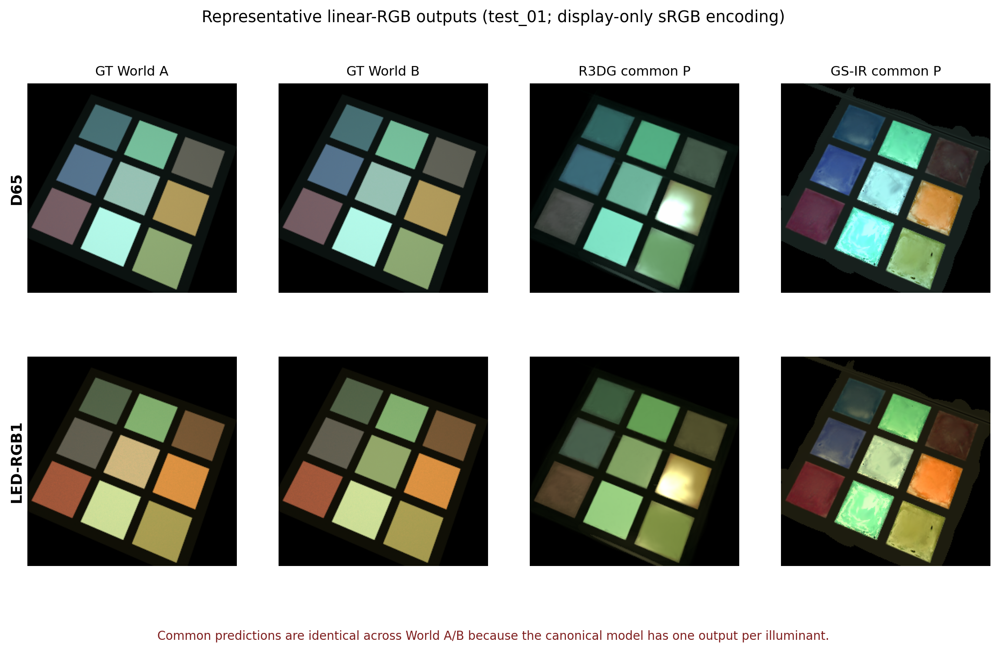
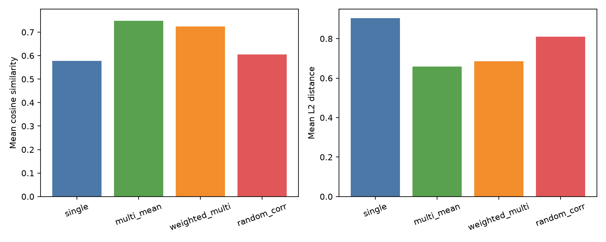
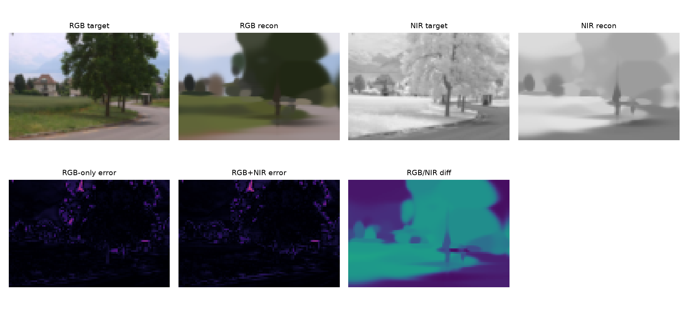

# 광학·분광·재조명 연구

**Gaussian에 조명 반응과 분광 단서를 담기 위해, 작은 실측 데이터 실험부터 합성 메타머리즘과 다중시점 특징 집계까지 검증한 연구 포트폴리오.**

[결과 그림](#결과-미리보기) · [연구 질문](#연구-질문과-목표) · [구현 과정](#구현-과정) · [실험 결과](#결과와-분석) · [다음 단계](#한계와-다음-단계) · [재현 안내](#재현과-자료-안내)

[독립 GitHub 저장소](https://github.com/YuSihyeon/OpticalResearch) · [상세 연구 기록 원문](RESEARCH_REPORT.md) · [전체 데이터와 복원 범위](DATA_AND_RESTORE.md)

## 프로젝트 개요

이 연구는 **무엇을 Gaussian의 속성으로 표현해야 새로운 조명에서 더 타당한 영상을 만들 수 있는가**를 단계적으로 탐색한다. 실측 RGB/NIR·다중조명 영상의 2D 실험, 합성 분광 장면의 메타머리즘 검증, 합성 Lego의 다중시점 특징 집계가 서로 다른 가설을 담당한다.

| 연구 축 | 실제 검증 단위 | 핵심 관찰 | 성과 수준 |
|---|---|---|---|
| RTI-Gaussian | DiLiGenT `ball` · 24조명 중 18개 학습 | 첫 홀드아웃에서 RTI MAE 0.02628 | 조명 반응 속성의 작은 2D 비교 |
| RGB-NIR Gaussian | EPFL `country_0000` 한 페어 | 공유 geometry로 RGB/NIR 표현·차이 시각화 | 재질 단서 탐색 |
| Spectral metamerism | 합성 World A/B · 6조명 · 8포즈 | LED-RGB1의 GT 상대 L2 차이 0.53035 | RGB 모호성 검증, 모델 분리 판정은 `INCONCLUSIVE` |
| View-to-Gaussian | 합성 Lego 36뷰 · 1,800점 | 다중시점 평균 cosine 0.74819 | 특징 집계 앞단의 합성 PoC |
| Spectral 3DGS 확장 | 다중 후보·가중치·분광 조명 설계 | 불확실성을 유지하는 표현 제안 | 전체 모델의 구현·성능 검증은 미완료 |

> **현재 성과의 범위:** 네 실험은 서로 다른 입력과 평가 조건을 사용한다. 완성된 분광 3DGS 하나의 통합 성능으로 합산하지 않는다. 2026-09-16 정리는 기존 코드·수치·그림의 교차 검토이며 재학습 결과가 아니다.

## 결과 미리보기

### 같은 RGB에서 출발해 새로운 조명에서 달라지는 두 세계

*왼쪽 두 열은 반사 스펙트럼이 다른 World A/B의 정답, 오른쪽은 모델별 공통 예측이다. 각 모델은 조명마다 출력 하나를 가지며 A/B 스펙트럼을 각각 복원한 결과가 아니다.*

[실험 설계 그림](evidence/metamerism/figures/04_experiment_design_logic.png) · [최종 검증 보고서](evidence/metamerism/causal_metamerism_validation.md) · [연구 미팅 PDF, 6쪽](evidence/reports/metamerism-meeting-2026-08-13.pdf)

### 여러 시점의 특징을 같은 3D 위치에 모으기

*36개 합성 시점의 leave-one-out 평가. 단순 평균이 가장 높았고, radial 방향 가중치는 이를 개선하지 못했다. 지표는 CNN 특징의 일치도이며 분광 복원 정확도는 아니다.*

[개별 대응 예시](evidence/multiview/results/point_visualizations/point_32721_consistency.png) · [집계 CSV](evidence/multiview/results/summary.csv) · [집계 연구 제안 PDF, 8쪽](evidence/reports/multiview-spectrum-proposal.pdf)

### 실측 데이터에서 시작한 속성 표현 실험

*RGB/NIR의 공간 구조를 공유하고 모달리티별 값을 따로 학습한 결과. 차이 그림에는 분광 반응뿐 아니라 정렬·노출·저해상도 표현 오차가 섞일 수 있다.*

[RTI 원본 결과 패널](evidence/pilot/results/rti_gaussian/rti_panel.png) · [RTI 손실 곡선](evidence/pilot/results/rti_gaussian/loss_curve.png) · [초기 실험 설계](evidence/pilot/design.md)

이 저장소의 공개 결과는 실제 저장된 그림·표·보고서로 구성한다. 별도 시연 영상은 확보되지 않았다.

## 연구 질문과 목표

### 조명 반응과 숨은 스펙트럼을 어떻게 구분할 것인가

RGB 관측은 조명 SPD, 표면 반사 스펙트럼, 카메라 감도의 결합 결과다. 기준 조명에서 같은 RGB를 만드는 서로 다른 스펙트럼이 다른 조명에서는 달라질 수 있다는 점이 중심 문제다. 따라서 입력 영상을 잘 재구성하는 것, 새 조명에서 타당한 모습을 예측하는 것, 숨은 스펙트럼을 식별하는 것을 각각 평가해야 한다.

| 질문 | 실험으로 분리한 요인 | 확인할 목표 |
|---|---|---|
| 고정 색 대신 조명 반응을 저장하면 유리한가 | 2D geometry·학습 예산을 작게 제한 | RTI와 고정 RGB·Lambertian의 조명 일반화 비교 |
| NIR는 어떤 추가 단서를 제공하는가 | 동일 geometry와 RGB/NIR 속성 분기 | 공간 구조 공유와 모달리티 차이 시각화 |
| 같은 RGB로 숨은 세계를 구별할 수 있는가 | 기하·카메라·노출 고정, spectrum만 변경 | source RGB 동일성 및 조명별 GT 분리 |
| 여러 시점의 특징을 모으면 안정적인가 | 알려진 pose·제공 점군으로 대응 구성 | 같은 점의 미사용 관측 특징과 일치도 비교 |

### 연구 방향의 변화

2026-07-15 설계는 3D 투영·가림을 제거하고 Gaussian 속성 차이를 작은 CPU 실험으로 먼저 검증하려는 의도를 담고 있다. 2026-08-13 미팅 자료는 RGB 모델의 재질·조명·기하 분해를 분석하는 방향을 먼저 수행하고, 추가 정보·제약을 넣는 방법 개발로 확장하겠다고 정리한다. 이후 제안은 Gaussian마다 하나의 정답 spectrum을 확정하기보다 여러 후보와 상대 가중치를 유지하는 방향이다. 일정·목표 학회가 비어 있는 항목은 확정된 연구 계획으로 복원하지 않았다. [설계 원문](evidence/pilot/design.md), [미팅 자료](evidence/reports/metamerism-meeting-2026-08-13.pdf).

## 수행 내용과 기여 범위

| 프로젝트에서 수행한 작업 | 사용한 기존 도구·자료 | 남아 있는 기여와 검증 경계 |
|---|---|---|
| 2D Gaussian 속성 비교 구성 | Python/PyTorch, DiLiGenT, EPFL RGB-NIR | loader·모델·학습·패널·지표 코드; 완전한 3DGS는 아님 |
| 메타머 A/B 대조와 조명별 비교 | Mitsuba 3, 공개 Nikon D5100 응답, R3DG·GS-IR | 실험 계약·GT/모델 비교·proxy 오류 진단 |
| View-to-Gaussian 집계 PoC | NeRF Synthetic Lego, 알려진 Blender pose, ResNet18 | 투영·선별·sampling·집계·leave-one-out 코드 |
| 분광 확장 구조 제안 | 기존 R3DG geometry·alpha splatting을 바탕으로 한 설계 | 후보 표현·불확실성 평가의 연구 구상 |
| 보존 자료 감사 | 기존 CSV/JSON·소스·PDF·이미지 | 수치·평가 범위 정정, 원본 연결과 재현 제약 공개 |

외부 재조명 모델·렌더러·사전학습 CNN 전체를 독자 구현 성과로 분류하지 않는다. Nikon은 공개 센서 응답을 수치 적분에 사용한 것이며 실물 카메라 촬영을 의미하지 않는다.
Unity viewer는 결과 PNG 탐색용이고 원 보고서는 라이선스 부재로 자동 실행 실패를 기록한다. Unity에서 분광 3DGS가 실행됐다는 근거는 아니다.

## 데이터와 선정 과정

| 실험 | 실제 사용한 입력 | 선택 이유·대체 과정 | 보유 전체와의 구분 |
|---|---|---|---|
| RTI | DiLiGenT single-view `ball`, 24조명, 60×72 | 실측 영상과 조명 방향·세기·mask가 함께 있음 | 보존 전체는 10물체×96조명이며 모두 실험하지 않음 |
| RGB-NIR | EPFL `country_0000.jpg` 한 패널, 64×96 | 작은 실제 RGB/NIR 페어를 확보할 수 있었음 | `jpg1`·`jpg2` 각각 477장 보유와 한 페어 평가는 다름 |
| 메타머리즘 | 합성 두 세계, D65 기준 RGB, 6조명×8포즈 | 숨은 spectrum과 관측 RGB를 통제해서 분리 | 실세계 분광 카메라 측정 데이터가 아님 |
| 특징 집계 | Lego RGBA 36뷰, 256 크기, 제공된 50,000점 | 당시 raw HSI 접근과 COLMAP 부재로 합성 대체 | 알려진 pose를 사용해 SfM 추정 단계를 생략 |

RTI의 홀드아웃 인덱스는 0부터 `[3, 7, 11, 15, 19, 23]`이고 나머지 18조명으로 학습했다. RGB/NIR는 하나의 파일 안에 나란히 들어 있어 로더가 검은 테두리를 잘라 좌측 RGB·우측 NIR를 나눈다. JSON의 두 경로가 같은 이유다.

HS-NeRF Tools/Origami와 Caladium raw HSI, Active RGB-NIR는 당시 접근 가능한 다운로드를 찾지 못했다는 기록이 있다. 이것은 당시 대체 선택의 근거이며 현재 데이터의 공개 여부를 새로 검증한 결론은 아니다. DiLiGenT-MV·OpenIllumination은 더 큰 다중시점 확장 후보로 남았다. [데이터 로더](evidence/pilot/source/gaussian_pilot/datasets.py), [Lego 선택 기록](evidence/multiview/README.md).

### 특징 집계에서 실제로 남긴 관측

최소 4뷰 조건에서 최대 1,800점을 선별했고, 실제 남은 점의 track 길이는 **8~36뷰**다.
가시성은 alpha ≥ 0.2 및 점군 z-buffer의 깊이 허용차 0.08로 근사했다. seed는 7이다.
총 44,304 관측은 같은 점과 카메라를 반복 포함하며 독립적인 44,304개 장면을 의미하지 않는다.
원 보고서의 “8~27뷰” 대신 [설정](evidence/multiview/configs/lego_fallback.json)과 [CSV 감사](evidence/review/aggregation-audit.json)의 범위를 사용한다.

## 구현 과정

### 1. RTI: 조명 반응을 Gaussian 속성으로 비교

1. 조명 방향을 정규화하고 영상을 제공된 광원 세기로 나눈 뒤 `[0,1]`로 제한한다.
2. 영상·mask를 줄여 96개 2D Gaussian의 위치·축별 크기·opacity를 학습한다.
3. Fixed RGB, Lambertian albedo/normal/ambient, RGB별 7계수 RTI를 각각 비교한다.
4. Gaussian weight를 정규화한 `Σ weight × value / Σ weight`로 픽셀을 합성한다.
5. Adam·mask 기반 제곱오차로 100 iteration 학습하고 보존된 홀드아웃 지표를 확인한다.

RTI basis는 `[1, lx, ly, lz, lx², ly², lx·ly]`이고 softplus로 음수 출력을 막는다.
이는 이미지 평면의 가중 평균이며 깊이 정렬을 사용하는 3D alpha compositing은 아니다.
다항식 반응은 highlight·그림자까지 흡수할 수 있어 물리적 BRDF 복원으로 곧바로 해석하지 않는다.
근거: [모델](evidence/pilot/source/gaussian_pilot/models.py), [합성·지표](evidence/pilot/source/gaussian_pilot/splats.py), [학습](evidence/pilot/source/gaussian_pilot/train.py), [실험 entry point](evidence/pilot/source/experiment_rti_gaussian.py).

### 2. RGB-NIR: 공간 구조를 공유하고 속성을 분기

RGB-only와 RGB/NIR 공유 모델을 96개 Gaussian·100 iteration 조건에서 각각 학습한다.
공유 모델은 위치·크기·opacity를 함께 쓰고 RGB 3개 값과 NIR 1개 값을 별도로 가진다.
차이 패널은 Gaussian별 `abs(NIR - mean(R,G,B))`를 다시 splatting한 결과다.
코드의 `reflectance` 명칭만으로 보정된 물리 반사율을 주장하지 않는다. [실행 코드](evidence/pilot/source/experiment_rgb_nir_gaussian.py).

### 3. 메타머리즘: source 동일성과 렌더 결과를 나누어 평가

1. 동일 기하·카메라·노출의 World A/B에서 반사 spectrum만 바꾼다.
2. D65·Nikon 응답을 적분한 source RGB가 수치적으로 같도록 구성한다.
3. D65, D50, D75, Illuminant A, LED-B5, LED-RGB1의 spectral GT를 만든다.
4. RGB 모델별 공통 예측을 GT A·GT B·두 GT의 중간값에 각각 비교한다.
5. linear RGB·고정 노출·공통 ROI에서 대칭 상대 L2를 계산한다.

지표는 `||A-B|| / ((||A||+||B||)/2 + 1e-12)`다. LED-RGB1에서 정한 ROI를 다른 조명에도 적용한다.
PNG의 sRGB 표현은 보기용이며 수치 평가 대상은 linear 배열이다. [평가 계약](evidence/metamerism/causal_metamerism_validation.json), [baseline 정의](evidence/metamerism/baseline_reproduction.json).
RGB 방법에는 SPD와 유한 면적 광원을 직접 넣기 어려워 보드 중심 irradiance를 맞춘 direction-only proxy를 사용했다. 중심 광량 일치가 전체 면의 일치를 보장하지 않아 위치별 오차를 따로 진단했다.

### 4. View-to-Gaussian: 알려진 위치에서 특징 집계

1. 36개 RGBA를 흰 배경에 합성해 pseudo-RGB를 만든다.
2. 공식 pretrained ResNet18의 `layer3` 특징을 추출한다.
3. Blender pose로 제공된 점/Gaussian 중심을 각 영상에 투영한다.
4. alpha와 점군 깊이로 관측을 선별하고 투영 위치의 특징을 bilinear sampling·L2 정규화한다.
5. 한 관측을 제외하고 나머지 관측을 집계한 뒤 제외한 특징과 cosine·L2를 비교한다.

비교는 단일 관측, 동일 점 평균, radial 방향 가중 평균, 다른 점의 여러 관측 평균이다.
근거: [가시성·track](evidence/multiview/src/tracks.py), [평가](evidence/multiview/src/evaluate.py), [집계](evidence/multiview/src/aggregation.py), [실행 요약](evidence/multiview/results/run_summary.json).

### 5. 제안한 전체 구조와 아직 검증하지 않은 부분

제안은 다중시점 RGB/pose → 특징 집계 → posterior network의 spectral 후보·가중치 → basis coefficient → direct/indirect 분광 조명 → spectral PBR·alpha splatting → 카메라 응답 적분의 흐름이다.
실제 Lego PoC는 특징을 모으는 앞단만 검증했다. spectral head 학습, 후보 확률 calibration, spectral GT 평가, 3DGS end-to-end 통합의 완료는 확인되지 않는다.
One-to-Many Spectral Upsampling·HyperGS·HSCNN+는 제안 문서가 밝힌 착안 관계이며 이 저장소에서 전부 재현했다는 의미는 아니다. [8쪽 제안 원문](evidence/reports/multiview-spectrum-proposal.pdf).

## 결과와 분석

### 실측 다중조명: 첫 홀드아웃의 비교

**조건: `ball`, 60×72, 96 Gaussian, 100 iteration, 18개 학습 조명.** 아래는 6개 홀드아웃 중 첫 조명 하나의 지표다.

| 모델 | MAE ↓ | PSNR ↑ |
|---|---:|---:|
| Fixed RGB | 0.028975 | 28.9196 dB |
| Lambertian | 0.036233 | 27.0825 dB |
| RTI | 0.026276 | 29.4450 dB |

[현재 metrics.json](evidence/pilot/results/rti_gaussian/metrics.json)과 코드의 `held_images[0]`, `held_lights[:1]`을 기준으로 범위를 한정했다.
RTI MAE는 Fixed RGB보다 약 9.32% 작지만 전체 홀드아웃 평균이나 다중 물체 일반화로 확장할 수 없다.
Lambertian의 낮은 결과도 초기화·짧은 학습·전처리 효과를 분리하지 않아 모델의 본질적 열세로 단정하기 어렵다.

### 실측 RGB-NIR: 한 페어의 재구성

**조건: `country_0000`, 64×96, 96 Gaussian, 100 iteration, 학습에 사용한 동일 페어 평가.**

| 출력 | MAE ↓ | PSNR ↑ |
|---|---:|---:|
| RGB-only의 RGB | 0.034878 | 25.1659 dB |
| 공유 모델의 RGB | 0.034175 | 25.3651 dB |
| 공유 모델의 NIR | 0.036244 | 저장되지 않음 |

[결과 JSON](evidence/pilot/results/rgb_nir_gaussian/metrics.json)에서 공유 RGB MAE가 약 2.02% 작다. 단일 실행의 재구성 결과이며 재질 분류나 재조명 성공을 입증하지 않는다.
[당시 종합 보고서](evidence/pilot/report-original.md)의 0.0426 / 0.0425 / 0.0406과 불일치하여 현재 JSON과 개별 결과를 표의 기준으로 삼았다.
차이 그림은 재질 prior의 후보 단서이지만 registration·노출·방사측정 보정과 재질 정답 라벨이 먼저 필요하다.

### 합성 메타머리즘: GT 분리와 모델 판정

**조건: 조명별 8포즈, linear RGB, 고정 노출·ROI. 수치는 대칭 상대 L2이며 정확도나 퍼센트 오차율이 아니다.**

| 조명 | GT A/B 차이 평균 | 8포즈 표준편차 | R3DG → GT A / B | GS-IR → GT A / B |
|---|---:|---:|---:|---:|
| D65 | 0.019484 | 0.000220 | 0.4238 / 0.4236 | 0.4707 / 0.4707 |
| D50 | 0.047751 | 0.000392 | 0.4533 / 0.4290 | 0.4469 / 0.4594 |
| D75 | 0.027038 | 0.000296 | 0.4121 / 0.4223 | 0.4828 / 0.4748 |
| Illuminant A | 0.154200 | 0.000542 | 0.5736 / 0.4921 | 0.3929 / 0.3674 |
| LED-B5 | 0.118625 | 0.000312 | 0.3901 / 0.4562 | 0.5029 / 0.4433 |
| LED-RGB1 | 0.530354 | 0.001015 | 0.7150 / 0.2923 | 0.3346 / 0.5481 |

source D65 RGB의 상대 차이는 약 `8.32e-16`이지만 렌더 D65 GT에는 약 0.01948의 잔차가 남는다. source 동일성과 최종 렌더의 완전 동일성을 구분한다.
LED-RGB1의 GT 분리는 훨씬 크지만 **모델은 조명별 공통 출력 하나**만 제공한다. 두 GT까지의 오차가 모델 A/B 출력 차이는 아니다.
따라서 `Pred_A - Pred_B`와 GT delta 방향 상관을 정의할 수 없어 최종 모델 분리 판정은 **`INCONCLUSIVE`**다. GT 메타머 분리와 모델의 숨은 spectrum 복원 성공은 서로 다른 주장이다.
근거: [조명별 CSV](evidence/metamerism/illuminant_separation.csv), [예측과 GT](evidence/metamerism/prediction_vs_gt.csv), [D65 대조](evidence/metamerism/exact_d65_control.csv).

### 합성 Lego: 특징 집계의 안정성

**조건: 36뷰·1,800점·44,304 leave-one-out 관측, ResNet18 layer3. 평가 대상은 RGB CNN feature다.**

| 방법 | cosine 평균 ↑ | L2 평균 ↓ | 대조의 의미 |
|---|---:|---:|---|
| Single-view | 0.577799 | 0.904653 | 같은 점의 다른 관측 하나 |
| Multi-view mean | 0.748193 | 0.658599 | 같은 점의 나머지 관측 평균 |
| Weighted multi-view | 0.724858 | 0.684736 | radial 방향 heuristic 적용 |
| Random correspondence | 0.604918 | 0.809914 | 다른 점의 여러 관측 평균 |

기존 CSV 재집계에서 mean이 single보다 높은 비율은 **90.83%**, random보다 높은 비율은 **91.52%**였다. [집계 CSV](evidence/multiview/results/summary.csv), [산술 감사 JSON](evidence/review/aggregation-audit.json).
Random도 여러 관측을 평균하므로 single과 집계 횟수가 같지 않다. coarse semantic feature의 유사성도 있어 개선 전부를 정확한 3D 대응의 효과로 돌릴 수 없다.
Weighted의 열세는 radial 방향이 실제 normal·visibility를 대체하지 못함을 점검할 이유다. [뷰 수별 그래프 자료](evidence/multiview/results/by_view_count.csv)는 같은 점에서 뷰 수만 바꾼 통제 실험이 아니다.

## 한계와 다음 단계

| 우선순위 | 현재 드러난 제약 | 다음 검증과 완료 기준 |
|---|---|---|
| 1 | 원본 실행 계약과 집계의 연결 부족 | 회수한 scene·SPD·응답·NPY·checkpoint·노출·좌표계를 실행 ID로 연결하고 수치 재계산 |
| 2 | RTI 한 조명·RGB-NIR 한 페어 | 전체 홀드아웃·여러 물체/페어·seed별 지표, JSON과 보고서 자동 일치 |
| 3 | proxy와 모델 오차의 혼합 | 유한 면적 광원 대조, D65 render 잔차, clamp·노출·좌표계 차이를 각각 분리 |
| 4 | 점군 가시성과 대조군의 근사 | 실제 visibility·동일 집계 수 negative·동일 점 view subsampling으로 비교 |
| 5 | spectral 후보 head 미검증 | 알려진 GT에서 spectrum 오차·새 조명 오차·정답 후보 포함률·calibration 동시 평가 |
| 6 | 전체 모델 통합 미완료 | held-out 장면·조명과 처리비용을 포함한 end-to-end 비교·ablation |

D65 proxy 상대 오차는 중심에서 R3DG 0.2409% / GS-IR 0.6966%, 모서리에서 15.0410% / 15.5639%였다. 이는 광원 기하 차이의 진단값이다. [proxy CSV](evidence/metamerism/proxy_error.csv).
시각 기록에는 R3DG 조명 좌표계 교정, GS-IR 내부 `[0,1]` clamp, IRGS stage 2/render의 WSL OptiX 차단이 남아 있다. [시행착오 기록](evidence/metamerism/visual-history/README.md).
seed 0/1/2 반복은 공식 entry point의 seed 0 고정으로 실행되지 않아 분산을 추정하지 못했다. [seed 대조](evidence/metamerism/seed_control.csv).
추가 세계별 조건을 줘 A/B 예측을 만들 경우, 그 정보 증가를 명시해야 한다. 다중시점 특징 평균의 개선만으로 RGB의 스펙트럼 비식별성이 해소되지는 않는다.

## 재현과 자료 안내

### 공개 코드와 재실행 조건

- RTI/RGB-NIR는 [실행 코드 폴더](evidence/pilot/source/)와 [requirements](evidence/pilot/source/requirements.txt)를 사용한다. 입력·seed·분할·해상도·iteration을 결과 JSON과 맞춘다.
- RTI의 기본 CLI는 16조명·64 Gaussian이므로 저장된 실험을 비교할 때 `--max-lights 24 --num-splats 96 --iterations 100 --max-size 72`를 명시한다.
- RGB-NIR는 `--num-splats 96 --iterations 100 --max-size 96`을 지정하고 실제 선택된 파일이 `country_0000.jpg`인지 확인한다. 데이터 목록이 바뀌면 같은 pair index도 다른 입력이 될 수 있다.
- 출력은 보존된 결과와 다른 새 작업 경로에 기록한다. smoke fixture 실행과 실제 DiLiGenT/EPFL 결과를 구별한다.
- Lego 코드는 원래 `view_to_gaussian_poc` 패키지 이름을 import한다. 공개 `evidence/multiview`는 검토용 배치이므로 [원래 실행 구조](evidence/multiview/README.md)를 갖춘 작업 복사본을 복구한다.
- Lego 실행기는 내부 `outputs`·`configs`를 기록하고 데이터·weight를 다운로드할 수 있다. 보관본에서 바로 실행하지 않고 새 작업 복제에서 환경 점검·기존 테스트·실행을 진행한다.

[실행 요약](evidence/multiview/results/run_summary.json)은 CPU 실험이고 [보고서](evidence/multiview/REPORT.md)는 Windows 11·Python 3.12.13·torch 2.13.0+cpu를 기록한다. 약 45.19초는 해당 실행의 시간이며 GPU benchmark가 아니다.

### 전체 원본의 보존 및 검증 상태

2026-09-16 후속 조사에서 **Ubuntu-22.04의 canonical `spectral-relighting-3dgs` 7,575파일, 2,073,810,252 bytes를 직접 추출하고 archive 내용과 SHA-256을 대조했다.**
여기에는 datasets·outputs·third_party·소스·설정과 checkpoint 확장자 파일 50개가 있다. 대표 NPY/NPZ 배열 읽기는 확인했지만 checkpoint 역직렬화·재학습·전체 렌더 재실행을 수행한 것은 아니다.
초기 Windows 검토 자료에 원본 NPY가 없었다는 기록과 후속 WSL 회수는 다른 조사 단계다. 96개 예측 배열 전체를 새로 재검산했다는 의미로 읽지 않는다.

| 자료 | 위치·문서 | 검토 목적 |
|---|---|---|
| 포트폴리오와 기존 기록 | 이 README · [RESEARCH_REPORT.md](RESEARCH_REPORT.md) | 요약과 기존 상세 설명의 비교; 원문 바이트 보존 |
| 연구 의도 | [미팅 PDF](evidence/reports/metamerism-meeting-2026-08-13.pdf) · [제안 PDF](evidence/reports/multiview-spectrum-proposal.pdf) | 실제 결과와 향후 설계 구분 |
| 공개 근거 | [pilot](evidence/pilot/) · [metamerism](evidence/metamerism/) · [multiview](evidence/multiview/) | 코드·설정·대표 그림·집계 수치 |
| 전체 데이터와 환경 | [DATA_AND_RESTORE.md](DATA_AND_RESTORE.md) | Windows 실험 원본·Lego 입력/weight·WSL canonical 프로젝트·전체 배포판 |

GitHub clone은 대형 데이터셋·모델·실행 환경을 모두 포함하지 않는다. 원본 전체는 별도 개인 보존 묶음에 유지한다.
로컬 내용·해시 검증, 외부 저장장치 전송, 초기화 후 전체 실행은 서로 다른 상태이며 마지막 두 항목은 아직 수행되지 않았다.
