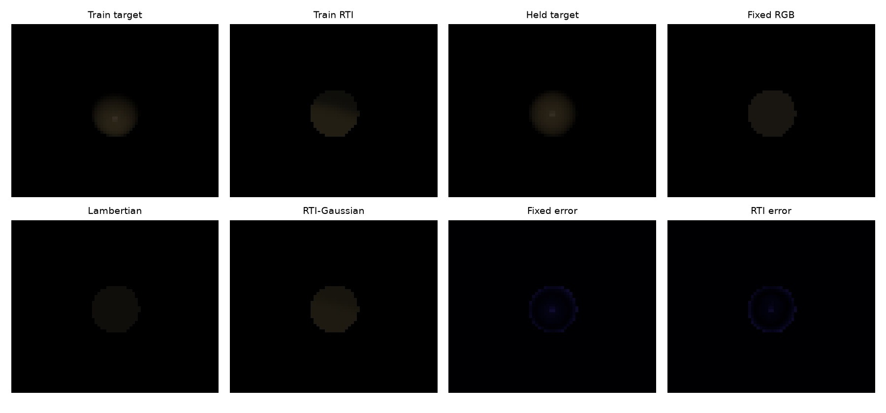
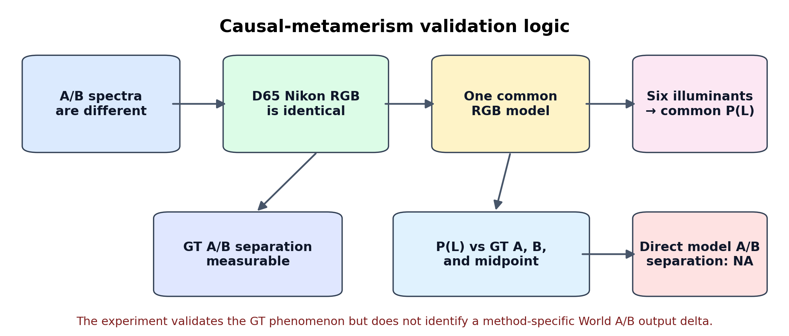
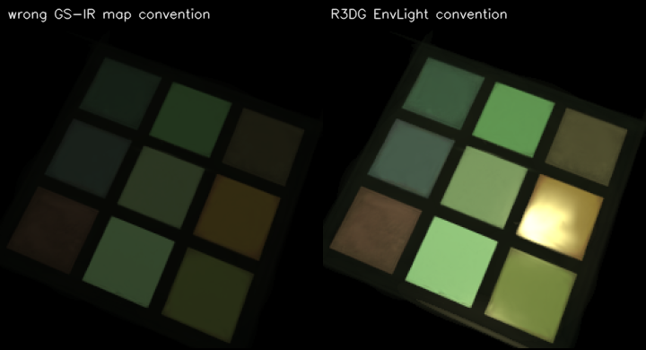
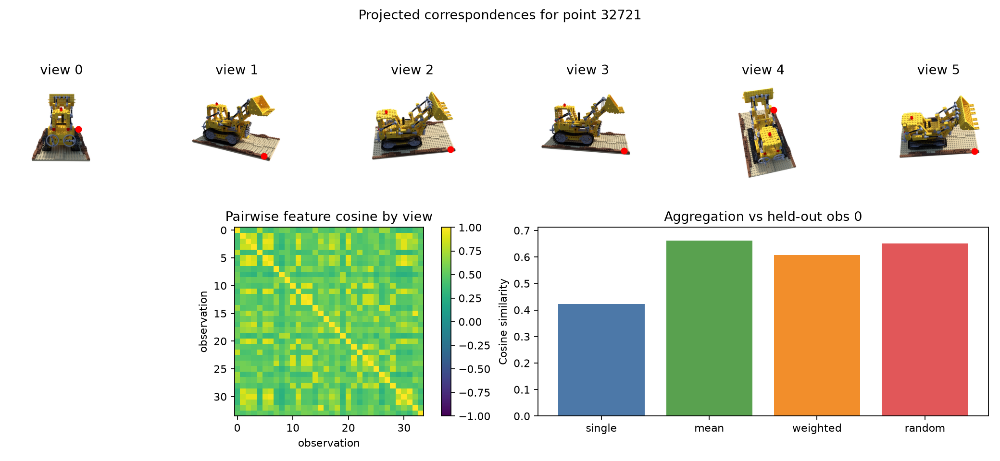

# Gaussian의 색에서 조명 반응과 스펙트럼 후보로

이 연구는 **Gaussian에 보이는 RGB만 저장하는 대신 조명 반응과 파장별 재질 단서를 담으면, 새로운 조명에서 더 타당한 영상을 만들 수 있는가**에서 출발한다. 실측 다중조명·RGB/NIR 영상으로 속성 표현을 작게 비교하고, 합성 메타머 장면으로 RGB만으로 구분되지 않는 정답을 구성했다. 이후에는 하나의 스펙트럼을 확정하기보다 여러 후보를 유지하는 표현을 제안하고, 그 입력을 만들기 위한 다중시점 특징 집계를 별도로 검증했다.

*그림 1. 이 연구의 중심 문제를 드러내는 `test_01` 시점이다. 위 행은 D65, 아래 행은 LED-RGB1이며, 왼쪽 두 열은 반사 스펙트럼이 다른 World A/B의 spectral 정답이다. D65에서는 비슷하게 보이는 패치들이 조명을 바꾸면 서로 다르게 반응한다. 오른쪽은 R3DG와 GS-IR가 조명마다 만드는 공통 예측 하나씩이다. 각 방법이 A와 B를 각각 복원한 그림이 아니다. 표시에는 sRGB encoding을 사용했지만 수치 평가는 고정 노출의 linear RGB 배열로 수행했다. 정답 사이의 차이와 모델 예측의 오차를 분리해서 읽어야 한다.*

실험의 연결은 질문의 발전을 보여 주지만, 각 결과가 하나의 완성된 분광 3DGS의 성능을 구성하는 것은 아니다. RTI와 RGB-NIR는 실측 데이터의 **2D Gaussian 속성 실험**, 메타머리즘은 **합성 분광 정답과 RGB 모델의 비교**, Lego는 **알려진 기하에서의 특징 집계 실험**이다. 이 문서는 2026-09-16에 기존 코드·CSV/JSON·그림·보고서를 대조해 평가 범위를 정리한 것으로, 새 재학습 결과를 추가한 것은 아니다.

[독립 연구 저장소](https://github.com/YuSihyeon/OpticalResearch) · [보존한 상세 연구 기록](RESEARCH_REPORT.md) · [전체 데이터·환경의 복원 경로](DATA_AND_RESTORE.md)

## 먼저 Gaussian에 무엇을 저장할지 분리해서 실험하다

2026-07-15의 [초기 설계](evidence/pilot/design.md)는 완전한 3D renderer에 앞서 Gaussian의 **속성 모델**을 비교하겠다는 의도를 명시한다. 3D 투영·깊이 정렬·가림을 함께 최적화하면 영상 오차가 속성 표현 때문인지 기하 때문인지 판단하기 어려워진다. 설계는 이미지 평면 위 2D Gaussian으로 범위를 줄여 고정 RGB, Lambertian albedo/normal, 다항식 조명 반응, RGB/NIR 분기를 각각 비교하도록 했다. 작은 CPU 실험으로 연구 가설을 먼저 살피려는 선택이다.

자료 선택도 이 목적에 맞춰 기록되어 있다. DiLiGenT single-view는 실제 촬영 영상과 조명 방향·세기·mask가 함께 있어 한 물체의 조명 반응을 다루기 적합했다. 더 큰 DiLiGenT-MV와 OpenIllumination은 다중시점 복잡도를 추가하는 확장 대상으로 남겼다. EPFL RGB-NIR는 실제 페어 영상을 작은 부분집합으로 확보할 수 있어 재질 단서를 살피는 실험에 사용했다. Active RGB-NIR는 당시 접근 가능한 데이터 다운로드를 찾지 못했다는 기록이 있다. 이것은 당시의 선택 근거이며 현재 배포 상황에 대한 새 조사 결과는 아니다.

이 설계에서 중요한 구분은 조명 반응을 더 잘 표현하는 것과 숨은 물리량을 복원하는 것이 같지 않다는 점이다. 조명 방향을 넣어 영상을 맞추는 다항식은 유용할 수 있지만, 그 계수가 보정된 BRDF일 필요는 없다. RGB와 NIR를 함께 재구성해 차이를 드러내더라도 곧바로 물리 반사율이나 재질 라벨을 얻는 것은 아니다. 뒤의 합성 메타머리즘 실험은 이 간극을 더 직접적인 대조로 다룬다.

## RTI-Gaussian: 고정 색에 조명 방향의 반응을 더하면 무엇이 달라지는가

### 실측 조명은 유지하고 3D 기하의 복잡도는 제거했다

실제로 실행한 입력은 DiLiGenT single-view의 `ball`, 24개 조명, 60×72 해상도다. 보유 원본은 10물체×96조명이지만 그 전체를 학습·평가한 결과는 아니다. 0부터 시작하는 인덱스 `[3, 7, 11, 15, 19, 23]`을 홀드아웃으로 두고 나머지 18조명으로 학습했다. [로더](evidence/pilot/source/gaussian_pilot/datasets.py)는 조명 방향을 정규화하고, 영상을 제공된 광원 세기로 나눈 뒤 `[0,1]`로 제한하며 영상과 mask를 축소한다. 이 전처리가 정한 수치 범위 안에서 이후의 오차를 읽어야 한다.

세 모델 모두 위치·축별 크기·opacity를 학습하는 96개 2D Gaussian을 사용하고 100 iteration 동안 Adam과 mask 기반 제곱오차로 학습한다. 픽셀은 `Σ weight_i × value_i / Σ weight_i`의 정규화 가중 합으로 만든다. 작은 해상도에서 조밀한 weight map을 계산하는 구조로, 깊이 순서의 3D alpha compositing과는 다르다. [Gaussian 합성과 지표](evidence/pilot/source/gaussian_pilot/splats.py), [학습 코드](evidence/pilot/source/gaussian_pilot/train.py).

Fixed RGB는 조명과 무관한 RGB 세 값을 저장해 평균적인 외관을 기억하는 기준선이다. Lambertian은 RGB albedo·단위 normal·ambient로 단순하고 해석 가능한 조명 반응을 만들며, RTI는 각 RGB 채널에 7개 다항식 계수를 둔다. RTI basis는 `[1, lx, ly, lz, lx², ly², lx·ly]`이고 계수 결합 후 softplus를 적용해 음수 출력을 막는다. 세 표현을 비교한 이유는 색만 기억하는 모델, 단순 광학 가정의 모델, 경험적 반응을 직접 학습하는 모델 사이에서 어떤 차이가 생기는지 보기 위해서다. 동일한 Gaussian 수와 짧은 학습 예산을 사용하지만 속성의 자유도까지 같은 비교는 아니다. [모델 정의](evidence/pilot/source/gaussian_pilot/models.py).

### 저장된 패널과 첫 홀드아웃의 수치

*그림 2. 위 행은 학습 조명의 정답과 RTI 재구성, 홀드아웃 정답, Fixed RGB 예측이고, 아래 행은 Lambertian·RTI 예측 및 Fixed RGB·RTI 오차다. 60×72, 96 Gaussian, 100 iteration 조건의 원본 저장 패널이다. 표현된 물체 영역이 작고 전체 표시가 어두워 세부 조명 반응의 정성 비교에는 한계가 있다. 밝기를 새로 보정한 그림으로 바꾸지 않았으며, 이 패널의 작은 차이를 전체 조명 일반화 성능으로 확대하지 않는다.*

| 모델 | 첫 홀드아웃 조명 MAE ↓ | 같은 조명 PSNR ↑ |
|---|---:|---:|
| Fixed RGB | 0.028975 | 28.9196 dB |
| Lambertian | 0.036233 | 27.0825 dB |
| RTI | 0.026276 | 29.4450 dB |

[현재 metrics.json](evidence/pilot/results/rti_gaussian/metrics.json)은 RTI의 MAE가 Fixed RGB보다 약 9.32% 작고 PSNR이 약 0.525 dB 높다는 결과를 담는다. 그러나 [실험 entry point](evidence/pilot/source/experiment_rti_gaussian.py)는 `held_target = held_images[0]`, `rti(held_lights[:1])[0]`으로 **첫 홀드아웃 조명 하나만** 지표에 넣는다. 여섯 조명을 분리해 둔 것과 여섯 조명 전체를 평균 평가한 것은 다르다. 이 표는 후자가 아니다.

이 결과는 고정 색보다 조명 반응 속성을 저장하는 것이 유리할 수 있다는 제한된 관찰이다. RTI는 경험적 다항식으로 highlight나 그림자까지 흡수할 수 있으므로 낮아진 재구성 오차가 물리 BRDF의 복원을 입증하지 않는다. Lambertian이 더 나빴다는 결과도 보존하지만, 짧은 100 iteration, 초기화, 세기 정규화와 clamp의 영향을 분리하지 않아 Lambertian 가정 자체의 열세로 결론낼 수 없다. [손실 곡선](evidence/pilot/results/rti_gaussian/loss_curve.png)은 학습의 진행을 보여 주며 홀드아웃 조명 전반의 검증을 대신하지 않는다.

다음 비교에서는 여섯 홀드아웃 모두의 개별·평균 오차를 남기고, 여러 물체와 seed에서 각 모델의 수렴 수준을 확인해야 한다. 영상 bit depth·전달함수·방사측정 범위·광원 세기 정규화도 고정할 필요가 있다. 이 조건이 마련되어야 2D에서 나타난 차이가 3D 투영과 가시성을 포함한 모델에서도 유지되는지 물을 수 있다.

## RGB-NIR Gaussian: 같은 공간 구조에 다른 파장대의 단서를 놓다

### 재조명 이전에 재질 단서가 드러나는지 살핀 실험

RGB-NIR 실험의 의도는 새 조명 영상을 생성하는 데 앞서 RGB에서 비슷하게 보이는 영역이 NIR에서 다른 반응을 보이는지 살피는 것이다. 입력은 EPFL browser subset의 `country_0000.jpg` 한 파일이다. 하나의 패널 안에 RGB와 NIR가 좌우로 배치되어 있어 로더가 밝기 기준으로 검은 테두리를 자르고 왼쪽 RGB·오른쪽 NIR를 나눈다. 결과 JSON에서 두 경로가 같은 것은 하나의 영상을 잘못 중복 입력한 것이 아니라 이 저장 형식 때문이다. 보존 전체의 `jpg1`·`jpg2` 각각 477장과 실제 평가한 한 페어를 구분한다. [데이터 처리](evidence/pilot/source/gaussian_pilot/datasets.py).

최종 64×96 영상에 96개 Gaussian, 100 iteration을 사용해 RGB-only 모델과 RGB/NIR 공유 모델을 각각 학습했다. 공유 모델은 위치·크기·opacity를 함께 쓰고 RGB 세 값과 NIR 한 값을 따로 둔다. 같은 공간 기저 위에 두 관측의 값을 놓으면 영역별 차이를 대응시키기 쉽다는 것이 이 설계의 의미다. RGB/NIR 차이 패널은 각 Gaussian의 `abs(NIR - mean(R,G,B))`를 다시 splatting한 결과다. 코드에 `reflectance`라는 이름이 있어도 센서·노출·광원을 보정한 물리 반사율이라는 뜻은 아니다. [실행 코드](evidence/pilot/source/experiment_rgb_nir_gaussian.py), [분기와 차이의 정의](evidence/pilot/source/gaussian_pilot/models.py).

*그림 3. 위 행은 RGB 정답·재구성과 NIR 정답·재구성, 아래 행은 RGB-only 오차·공유 모델의 RGB 오차·RGB/NIR 차이이다. 나무와 잔디 등 넓은 영역에서 두 파장대의 명암이 다르게 나타나고 공유 모델도 그 차이를 표현한다. 동시에 작은 가지·경계의 세부 구조는 96개 Gaussian의 재구성에서 평활화된다. 마지막 패널은 학습 속성의 차이 시각화이며 재질 정답 지도나 파장별 반사율 측정값이 아니다.*

| 평가 | 같은 학습 페어의 MAE ↓ | PSNR ↑ |
|---|---:|---:|
| RGB-only의 RGB 재구성 | 0.034878 | 25.1659 dB |
| RGB+NIR 공유 모델의 RGB 재구성 | 0.034175 | 25.3651 dB |
| RGB+NIR 공유 모델의 NIR 재구성 | 0.036244 | 저장되지 않음 |

공유 모델의 RGB MAE는 약 2.02% 작다. 이는 학습에 사용한 한 페어의 재구성 결과이며 held-out 장면, 재질 분류, 재조명 성능의 평가가 아니다. [현재 metrics.json](evidence/pilot/results/rgb_nir_gaussian/metrics.json)과 개별 결과는 위 표에 일치하지만 [당시 종합 보고서](evidence/pilot/report-original.md)에는 0.0426 / 0.0425 / 0.0406과 다른 PSNR이 적혀 있다. 종합 표가 어느 실행을 반영하는지 확정할 로그가 없어 수치를 혼합하지 않고 현재 JSON을 기준으로 삼았다.

여기서 얻은 것은 후속 재질 prior의 후보 단서다. 차이에는 분광 반응 외에도 RGB/NIR registration, 노출·처리 차이, 저해상도 모델의 오차가 섞일 수 있다. 여러 페어에서 정렬과 radiometric calibration을 확인하고 재질별 정답으로 분리 성능을 평가해야 차이의 원인을 좁힐 수 있다. 현재는 그 라벨과 새 조명 GT가 없다. 실험 결과를 위한 Unity viewer도 구성되었지만 역할은 PNG 탐색이며, 원 보고서는 라이선스 부재로 자동 실행 실패를 기록한다. Unity에서 분광 3DGS를 실행한 결과로 볼 수 없다.

## 메타머리즘: 입력 RGB가 같아도 새 조명의 정답은 하나가 아닐 수 있다

### 모호성을 통제된 두 세계로 구성한 이유

RGB 재조명 오류에는 재질 표현, 기하, 광원과 센서의 영향이 함께 들어 있다. 메타머리즘 실험은 그중 **기준 조명에서 관측 RGB가 같아도 숨은 반사 스펙트럼은 다를 수 있다**는 문제를 분리한다. 기하·카메라·노출이 같은 World A/B에서 반사 스펙트럼만 바꾸고, D65와 공개 Nikon D5100 응답으로 적분한 source RGB를 수치적으로 같게 맞춘다. 이후 광원만 바꾸어 두 세계의 spectral 정답이 얼마나 갈라지는지 확인한다. Nikon 응답은 수치 적분에 사용했으며 실물 카메라 촬영을 뜻하지 않는다. [2026-08-13 미팅 자료 2~4쪽](evidence/reports/metamerism-meeting-2026-08-13.pdf).

Mitsuba 3는 파장별 정답을 생성하고 R3DG·GS-IR는 RGB만 보는 비교 방법을 맡는다. 이 구성에서는 입력 영상 재구성, 새로운 조명에서의 예측, 숨은 스펙트럼의 식별을 같은 지표로 부를 수 없다. 특히 서로 다른 정답이 동일 입력을 만들도록 구성했다면, 입력에 없던 세계별 정보를 모델이 어떻게 얻는지부터 명시해야 한다.

*그림 4. 보존된 실험 설계 도식. 서로 다른 스펙트럼이 같은 source RGB를 만들고, 각 RGB 모델은 조명별 공통 예측 `P(L)` 하나를 출력한다. 왼쪽 가지의 GT A/B 분리는 측정할 수 있지만, 오른쪽 구조에는 세계별 `Pred_A`, `Pred_B`가 없다. 따라서 공통 예측에서 두 정답까지의 오차는 정의되어도 모델 자체의 A/B 출력 차이는 정의되지 않는다. 도식의 이 구분이 최종 `INCONCLUSIVE` 판정을 이해하는 핵심이다.*

2026-08-13 미팅 자료의 마지막 쪽은 추가 정보·제약을 넣는 방법 개발과 RGB 모델의 재질·조명·기하 분해를 분석하는 방향을 나누고, **분해 분석을 먼저 수행한 뒤 방법 개발로 확장**하겠다는 의도를 기록한다. 목표 학회와 다음 작업 일부는 비어 있어 구체적인 일정까지 확정된 상태는 아니다.

### 어떤 조명에서 정답이 갈라졌는가

조명은 D65, D50, D75, Illuminant A, LED-B5, LED-RGB1의 여섯 종류이며 포즈는 여덟 개다. 평가는 고정 노출의 linear RGB를 사용하고 LED-RGB1에서 정한 ROI를 다른 조명에도 동일하게 적용한다. 대칭 상대 L2는 `||A-B|| / ((||A||+||B||)/2 + 1e-12)`로 정의한다. PNG의 표시 RGB가 아니라 원래 linear 배열이 평가 대상이다. [평가 계약과 최종 JSON](evidence/metamerism/causal_metamerism_validation.json).

| 조명 | GT A/B 상대 L2 평균 | 8포즈 표준편차 |
|---|---:|---:|
| D65 | 0.019484 | 0.000220 |
| D50 | 0.047751 | 0.000392 |
| D75 | 0.027038 | 0.000296 |
| Illuminant A | 0.154200 | 0.000542 |
| LED-B5 | 0.118625 | 0.000312 |
| LED-RGB1 | 0.530354 | 0.001015 |

source D65 RGB의 상대 차이는 약 `8.32e-16`인 반면 렌더된 D65 GT ROI에는 약 0.01948의 잔차가 있다. 따라서 source 단계의 동일성이 최종 영상에서도 오차 없이 유지됐다고 말할 수 없다. 그 잔차를 별도 대조로 남기면서 LED-RGB1에서는 약 0.53035로 더 큰 분리가 나타났다는 것이 현재 결과다. 이 값은 인식 정확도나 백분율 오차율이 아니라 위 정의의 상대 거리다. [조명별 CSV](evidence/metamerism/illuminant_separation.csv), [D65 동일성 대조](evidence/metamerism/exact_d65_control.csv).

이 관찰은 새로운 광원의 분광 분포가 입력 조명에서 드러나지 않았던 반사 스펙트럼 차이를 드러낼 수 있음을 보여 준다. 동시에 D65 영상의 잔차는 후속 실험에서 source 구성과 렌더링을 더 엄밀하게 연결해야 한다는 신호다. 두 사실을 분리해야 RGB 정보의 모호성과 렌더링 파이프라인의 오차를 혼동하지 않는다.

### 공통 예측의 오차와 모델 분리 판정은 다르다

| 조명 | R3DG → GT A | R3DG → GT B | GS-IR → GT A | GS-IR → GT B |
|---|---:|---:|---:|---:|
| D65 | 0.4238 | 0.4236 | 0.4707 | 0.4707 |
| D50 | 0.4533 | 0.4290 | 0.4469 | 0.4594 |
| D75 | 0.4121 | 0.4223 | 0.4828 | 0.4748 |
| Illuminant A | 0.5736 | 0.4921 | 0.3929 | 0.3674 |
| LED-B5 | 0.3901 | 0.4562 | 0.5029 | 0.4433 |
| LED-RGB1 | 0.7150 | 0.2923 | 0.3346 | 0.5481 |

각 행의 A/B 열은 동일한 모델 출력 하나를 서로 다른 두 정답과 비교한 상대 L2다. 예를 들어 LED-RGB1에서 R3DG 출력은 B에, GS-IR 출력은 A에 더 가깝지만, 이것이 모델이 두 세계를 알아보고 각각 복원했다는 의미는 아니다. 기존 0.503632(R3DG), 0.441353(GS-IR)는 각 공통 예측에서 두 GT로의 **평균 오차**다. 두 GT의 중간값까지의 오차도 별도로 계산되어 LED-RGB1에서 각각 0.5335, 0.3706이다. [전체 예측 대조 CSV](evidence/metamerism/prediction_vs_gt.csv), [baseline 정의](evidence/metamerism/baseline_reproduction.json).

[최종 검증 보고서](evidence/metamerism/causal_metamerism_validation.md)의 판정은 **`INCONCLUSIVE`**다. 실험이 실행되지 않았다는 뜻이 아니라, 현재 출력 구조로는 `Pred_A - Pred_B`와 GT delta의 방향 상관을 정의할 수 없다는 뜻이다. 직접 모델 분리, Pearson/Spearman, delta 부호 일치 항목은 `null`/NA다. GT에서 메타머 분리가 나타났다는 결론은 유지되지만 모델이 숨은 스펙트럼을 복원했다는 결론은 지지되지 않는다.

동일 입력으로 모델을 두 번 학습해 서로 다른 출력이 생겨도 그 차이는 학습 변동일 수 있다. 추가 관측이나 명시적인 세계별 조건 없이 정답 세계를 식별한 것과 임의의 서로 다른 설명을 생성한 것을 구분해야 한다. 후속 `Pred_A/Pred_B` 인터페이스에 재질·spectrum 조건을 준다면 조건의 효과를 연구할 수 있지만, 그 결과를 다시 RGB-only 복원 성공으로 부를 수는 없다. 이 해석은 현 결과에서 도출한 다음 실험의 기준이다.

### 재조명 오차 안에 섞인 광원·좌표계·출력 범위 문제

RGB 방법에 SPD와 유한 면적 광원을 직접 전달하기 어려워 보드 중심 irradiance를 맞춘 direction-only 환경 조명 proxy를 사용했다. 이 변환은 비교 방법의 입력 형식에 맞추기 위한 근사이며, spectral GT와 완전히 같은 광원은 아니다. 유한 면적 광원은 위치에 따라 들어오는 방향과 세기가 달라지므로 중심 한 점에서 광량을 맞추어도 전체 보드가 일치하지 않는다.

| D65 위치 | R3DG proxy 상대 오차 | GS-IR proxy 상대 오차 |
|---|---:|---:|
| 중심 | 0.2409% | 0.6966% |
| 가장자리 | 7.4789% | 7.9674% |
| 모서리 | 15.0410% | 15.5639% |

[proxy CSV](evidence/metamerism/proxy_error.csv)의 위치별 증가가 이 한계를 보여 준다. 이는 학습 방법 단독의 성능 점수가 아니라 finite-area 광원과 위치 독립 direction-only proxy의 기하 차이를 진단한 값이다. 모델 오차를 해석할 때 광원 변환의 오차를 먼저 분리해야 하는 이유다.

*그림 5. R3DG에 GS-IR의 lat-long convention을 그대로 적용한 경우(왼쪽)와 R3DG EnvLight convention에 맞춰 바꾼 경우(오른쪽)의 진단 그림. 보드의 밝기와 highlight 분포가 크게 달라진다. 조명 좌표계의 연결만으로 외관이 달라질 수 있음을 보여 주며, 오른쪽 영상이 spectral GT와 정확히 일치하거나 재질 추정이 개선되었다는 평가 그림은 아니다.*

2026-08-12의 [시각 기록](evidence/metamerism/visual-history/README.md)에는 R3DG stage 1의 30k와 NeILF stage 2의 50k, GS-IR의 공식 teaser HDRI·raw proxy·fixed-exposure proxy 비교가 남아 있다. 이 과정은 모델 출력의 외관을 보기 전에 입력 조명과 capture 위치를 맞춰야 했음을 보여 준다. GS-IR의 linear NPY는 gamma/tone 변환 전이지만 공식 shading 내부 `[0,1]` clamp **이후**이고, R3DG capture는 sRGB encoding/clipping 전이다. 두 파이프라인의 출력 범위가 다르면 오차가 큰 이유를 분광 표현만으로 돌릴 수 없다.

완료되지 않은 시도도 연구 범위에 남긴다. IRGS는 stage 1 산출물이 있지만 WSL OptiX runtime 때문에 stage 2/render가 막혔다. 고정 5k iteration의 nested view-count 그림은 stage 1의 train-only RGB 진단으로, 시점 수가 spectral 식별성을 높였다는 근거는 아니다. seed 0/1/2 반복은 공식 entry point의 seed 0 고정으로 실행되지 않아 seed 분산도 추정하지 못했다. [seed 대조](evidence/metamerism/seed_control.csv), [시각 자료의 역사적 인덱스](evidence/metamerism/visual-history/INDEX.md). 인덱스는 원래 묶음 전체의 기록이어서 공개 선별본에 없는 파일명도 포함한다.

원 보고서는 R3DG 6×8, GS-IR 6×8의 총 96개 linear 예측 배열을 생성했다고 기록한다. 초기 Windows 검토에는 집계와 그림만 있었지만, 2026-09-16 후속 조사에서 WSL canonical 프로젝트의 데이터·출력·소스·checkpoint를 회수했다. 이 회수로 수치 재검산을 위한 원본 접근 경로는 확보되었으나 **96개 배열 전체의 새 재평가나 재학습은 수행하지 않았다.**

## 여러 시점의 특징을 같은 Gaussian 위치에 모으면 안정적인가

### 분광 후보 추정에 앞서 입력 특징의 집계를 검증했다

후속 Multi-view Spectrum 제안은 Gaussian마다 하나의 스펙트럼을 정답으로 확정하기보다, RGB 관측과 양립하는 여러 후보와 상대 가중치를 유지하는 방향이다. 그 앞단에는 각 Gaussian이 여러 시점에서 어떻게 보이는지 모으는 과정이 필요하다. Lego 실험은 이 전체 설계에서 **같은 3D 위치의 RGB 특징을 모으면 제외한 관측의 특징과 더 일치하는가**만 검증했다. spectral 후보 생성이나 새 조명 예측까지 시험한 것은 아니다.

[실험 기록](evidence/multiview/README.md)은 HS-NeRF Tools/Origami와 이후 Caladium의 raw HSI 다운로드를 당시 환경에서 찾지 못했고 COLMAP도 설치되어 있지 않았다고 설명한다. 그래서 NeRF Synthetic Lego의 알려진 Blender pose와 제공된 `lego.ply`를 사용했다. 이 대체는 RGB에서 대응·카메라를 새로 추정하는 단계를 건너뛰고, 이미 주어진 기하에서 투영·관측 선별·특징 집계를 시험하도록 실험을 좁힌 것이다. 당시 접근 제한을 현재 HSI 데이터의 공개 여부에 대한 결론으로 확장하지 않는다.

입력은 36개 RGBA 시점으로, 흰 배경에 합성한 크기 256의 pseudo-RGB를 사용했다. 공식 pretrained ResNet18 가중치의 `layer3` 특징을 torchvision 없이 구현한 네트워크로 추출하고, 제공된 50,000개 점/Gaussian 중심을 Blender 카메라로 투영했다. alpha ≥ 0.2와 점군 z-buffer의 깊이 허용차 0.08로 가시성을 근사한 뒤, 투영 좌표에서 bilinear sampling한 특징을 L2 정규화했다. 최소 4뷰 조건에서 최대 1,800점을 seed 7로 선별했으며, 실제 track 길이는 **8~36뷰**, 관측은 44,304행이다. [설정](evidence/multiview/configs/lego_fallback.json), [관측·가시성 코드](evidence/multiview/src/tracks.py), [실행 요약](evidence/multiview/results/run_summary.json).

### 관측 하나를 빼고 나머지로 얼마나 설명할 수 있는지 비교했다

leave-one-out 평가에서는 같은 점의 한 관측을 제외하고 나머지 관측으로 만든 특징을 그 제외한 특징과 비교한다. Single-view는 같은 점의 다른 관측 하나를 무작위로 고르고, Multi-view mean은 남은 관측을 단순 평균한다. Weighted multi-view는 radial view-angle heuristic으로 가중하고, Random correspondence는 다른 점의 여러 관측 평균을 잘못 연결한 대조다. 평가 대상은 RGB CNN feature의 cosine·L2이며 reflectance나 spectral radiance의 정답은 없다. [sampling·평가 구현](evidence/multiview/src/evaluate.py), [집계 구현](evidence/multiview/src/aggregation.py).

*그림 6. 점 32721의 대응 예시. 위쪽 빨간 점은 카메라 pose로 투영한 위치이며, 아래 왼쪽은 관측 간 특징 cosine, 오른쪽은 관측 0을 제외한 집계와 해당 관측의 일치도다. 이 점에서는 평균 집계가 single보다 높지만 다른 점에서 가져온 random 평균도 비슷하게 높다. 따라서 이 한 그림을 정확한 3D 대응의 단독 효과로 해석할 수 없다. 기하 위치를 투영하는 과정과 coarse CNN 특징의 유사성을 함께 점검하기 위한 사례다.*

| 방법 | held-out cosine 평균 ↑ | L2 평균 ↓ |
|---|---:|---:|
| Single-view | 0.577799 | 0.904653 |
| Multi-view mean | 0.748193 | 0.658599 |
| Weighted multi-view | 0.724858 | 0.684736 |
| Random correspondence | 0.604918 | 0.809914 |

*그림 7. 36뷰·1,800점·44,304 leave-one-out 관측의 전체 집계다. 왼쪽 cosine은 높을수록, 오른쪽 L2는 낮을수록 제외한 CNN 특징과 더 가깝다. 단순 평균이 가장 좋고 radial 방향 가중치는 이를 개선하지 못했다. 같은 점·카메라에서 여러 관측이 반복되므로 막대는 독립 장면 간 평균이나 통계적 신뢰구간을 나타내지 않는다.*

기존 `heldout_scores.csv`를 다시 집계했을 때 mean이 single보다 높은 cosine을 낸 비율은 **90.83%**, random보다 높은 비율은 **91.52%**였다. 평균 cosine 차이는 single 대비 +0.170394, random 대비 +0.143275다. 이는 재학습 결과가 아니라 기존 CSV의 산술 검산이다. [원래 집계 CSV](evidence/multiview/results/summary.csv), [감사 JSON](evidence/review/aggregation-audit.json).

### 좋아진 평균과 개선되지 않은 가중치를 함께 해석하기

이 장면에서는 여러 관측을 모은 특징이 단일 관측보다 미사용 관측과 더 일치했다. 그러나 random도 single보다 높은 평균을 보인다. 코드에서 random은 다른 점의 **여러 관측 평균**이고 single은 같은 점의 **관측 하나**여서 평균에 사용한 관측 수까지 통제된 비교가 아니다. ResNet `layer3`의 공간 해상도가 거칠고 의미 특징을 담아 서로 다른 Lego·배경 위치도 유사할 수 있다. 따라서 다중시점 평균의 개선 전부를 정확한 3D 대응의 효과로 돌리지 않는다.

Weighted가 mean보다 낮았다는 것은 설계한 방향 가중치가 이 조건에서 도움이 되지 않았다는 결과다. radial 방향은 실제 표면 normal이나 visibility가 아니므로 잘 보이는 표면의 신뢰도를 충분히 대변하지 못했을 가능성이 있다. 이 설명은 결과와 코드에 근거한 해석이며 원인 분리 실험은 아직 없다. true render depth·alpha contribution·재투영 오차를 반영한 가중치와 비교해야 한다. 경계·실루엣·가림 부근에서는 점군 z-buffer의 근사 때문에 다른 표면이나 배경 특징이 섞일 수 있다. [또 다른 대응 사례](evidence/multiview/results/point_visualizations/point_5602_consistency.png).

관측 수의 해석도 제한해야 한다. 44,304행은 같은 1,800개 점과 36개 카메라를 공유한다. 통계 분석을 확장할 때는 이 의존성을 고려해야 한다. [뷰 수별 CSV](evidence/multiview/results/by_view_count.csv)는 track 길이가 다른 점 집단을 비교하므로, 같은 점에서 시점 수만 늘린 통제 실험은 아니다. 원 보고서의 “8~27뷰” 표현과 달리 원자료 감사와 그래프에는 8~36뷰가 포함되어 이 문서는 그 범위를 따른다.

[실행 보고서](evidence/multiview/REPORT.md)는 Windows 11, Python 3.12.13, torch 2.13.0+cpu를 기록한다. RTX 5060 Ti가 있어도 설치된 torch가 CPU 버전이어서 GPU 실험은 아니었다. 실행 요약의 약 45.19초는 해당 로컬 실행 시간이며 일반적인 속도 benchmark로 읽지 않는다.

## 스펙트럼을 하나로 확정하지 않는 3DGS 확장 제안

[8쪽 Multi-view Spectrum 제안](evidence/reports/multiview-spectrum-proposal.pdf)은 기존 R3DG의 geometry와 alpha splatting을 바탕으로 Gaussian별 표현을 바꾸려는 설계다. 다중시점 RGB와 camera pose에서 CNN 특징을 추출하고 보이는 Gaussian 위치에 모은 뒤, MLP/Transformer posterior network가 여러 spectral 후보와 상대 가중치를 만들도록 한다. 스펙트럼 전체를 그대로 저장하는 대신 basis coefficient를 사용해 표현량을 줄이고, global direct light와 Gaussian별 local indirect light를 분광 표현으로 추정하는 흐름이다.

그 뒤 Gaussian별 spectral PBR과 alpha splatting으로 분광 영상을 합성하고 카메라 응답으로 적분해 RGB 관측과의 재구성 오차를 계산한다. 출력은 한 장의 RGB 예측에 그치지 않고 후보별 spectrum·재조명 영상·후보 가중치와 entropy, 영상 평균·분산 등으로 불확실성을 함께 보고하는 구상이다. 문서는 One-to-Many Spectral Upsampling의 다중 후보, HyperGS의 고차원 스펙트럼 압축, HSCNN+의 주변 공간 특징을 착안 관계로 밝힌다. 이는 제안의 출처이며 이 저장소가 해당 논문들을 모두 재현했다는 의미는 아니다.

실제로 검증된 범위는 그 앞단의 Lego 특징 집계다. spectral head 학습, 후보 가중치 calibration, spectral GT에 대한 radiance·reflectance 평가, direct/indirect 분광 조명, 3DGS end-to-end 통합의 완료는 확인되지 않았다. WSL에 checkpoint 파일이 보존되어 있다는 사실만으로 이 후속 posterior 모델까지 완성되었다고 해석하지 않는다.

메타머리즘 결과와 이 제안을 연결하면 평가 기준도 달라져야 한다. 입력 RGB 오차만 낮은 단일 후보는 관측에 잘 맞더라도 새 SPD에서 틀릴 수 있다. 여러 후보를 유지하는 모델은 정답 후보를 얼마나 포함하는지, 새 조명 예측의 분산이 실제 오차와 맞는지, 잘못된 확신을 얼마나 줄이는지까지 평가해야 한다. 다중시점 특징은 texture·semantic prior로 후보를 좁힐 가능성이 있지만 새로운 독립 분광 측정을 얻는 것과 같지는 않다. NIR·다중광원·HSI 같은 추가 관측을 쓰는 경우에는 RGB-only 조건과 분리해 정보 증가의 효과를 측정해야 한다.

## 현재 결론이 다음 실험에 요구하는 것

작은 실측 실험은 조명 반응과 RGB/NIR 속성을 Gaussian에 따로 담는 구현 가능성을 보였고, 첫 홀드아웃·한 페어에서 제한된 차이를 측정했다. 합성 실험은 같은 source RGB에 대응하는 서로 다른 스펙트럼이 새 조명에서 다른 정답을 만들 수 있음을 보였다. 특징 집계 실험은 같은 기하 위치의 여러 RGB 관측을 모으는 것이 단일 관측보다 일관적일 수 있음을 보였다. 이 세 결과는 각각 속성 표현, 관측의 모호성, 입력 특징의 안정성에 관한 것으로 하나가 다른 하나의 미검증 단계를 대신하지 않는다.

실측 비교를 확장하려면 RTI의 모든 홀드아웃·여러 물체·seed별 결과를 남기고 RGB/NIR의 여러 페어에서 정렬과 방사측정 보정을 확인해야 한다. 보고서와 JSON을 같은 실행 ID에서 생성해 현재 남은 수치 불일치도 줄여야 한다. 이 단계가 완료되어야 작은 파일럿의 경향이 반복되는지 판단할 수 있다.

메타머리즘은 회수한 scene·SPD·센서 응답·linear NPY·checkpoint와 평가 코드를 연결해 96개 배열 전체를 재검산하는 것이 우선이다. 그다음 exact source 대조와 D65 렌더 잔차, 유한 면적 광원과 proxy, 좌표계·exposure·clamp, 모델 학습 오차를 각각 분리해야 한다. seed 반복의 실행 경로도 확인해야 하며 현재 `INCONCLUSIVE` 판정을 단순히 모델 우열 표로 바꾸어서는 안 된다.

특징 집계에서는 실제 COLMAP 또는 학습된 GS의 기하·visibility를 사용하고, 동일한 관측 수를 평균하는 잘못된 대응 대조와 같은 점의 view subsampling을 추가해야 한다. 이후 알려진 spectral GT를 가진 최소 장면에서 후보 head를 검증하며 RGB 오차, spectrum 오차, 새 조명 오차, 후보 coverage와 calibration을 함께 측정하는 것이 순서다. 전체 3DGS 통합과 held-out 장면·조명, 처리비용 비교는 이 검증을 이어받는 다음 단계다.

## 코드·원본·실행 조건을 다시 연결하기

### 실측 파일럿과 Lego의 재실행

RTI/RGB-NIR는 [실행 코드 폴더](evidence/pilot/source/)와 [requirements](evidence/pilot/source/requirements.txt)를 사용한다. 저장된 실행을 비교할 때는 입력·seed·분할·해상도·iteration을 결과 JSON과 맞춰야 한다. RTI CLI 기본값은 16조명·64 Gaussian이므로 `--max-lights 24 --num-splats 96 --iterations 100 --max-size 72`를 명시한다. RGB-NIR는 `--num-splats 96 --iterations 100 --max-size 96`과 실제 선택된 파일 `country_0000.jpg`를 확인한다. 데이터 목록이 바뀌면 같은 pair index도 다른 영상을 가리킬 수 있다. smoke fixture와 실제 DiLiGenT·EPFL 결과는 구분하고 출력은 새 작업 경로에 기록한다.

Lego 소스는 `view_to_gaussian_poc`라는 원래 패키지 이름을 import한다. 공개 `evidence/multiview/`는 검토용 배치이므로 [원래 실행 구조](evidence/multiview/README.md)를 갖춘 작업 복사본에서 환경 점검·기존 테스트·실행을 진행한다. 실행기는 내부 `outputs`·`configs`에 기록하고 데이터·weight를 다운로드할 수 있다. 필요한 입력은 raw image·pose·PLY, processed 이미지, `resnet18-f37072fd.pth`, `projected_observations.npz`, `resnet18_features.npz`, 설정·CSV·run summary다. 원본 작업의 일부 코드는 미커밋 상태였으므로 Git 이력만으로 전체를 복원하지 않는다.

### Windows의 선별 결과와 WSL canonical 프로젝트

전체 경로는 [DATA_AND_RESTORE.md](DATA_AND_RESTORE.md)에 보존되어 있다. 이 저장소가 개인 묶음의 `04-OpticalResearch/repository/`일 때, `../originals/gs_windows/`에는 RTI/RGB-NIR·Lego의 전체 코드·입력·중간 NPZ·outputs·가중치·환경이 있고 `../originals/relight_windows/`에는 causal 검증 CSV/JSON/PNG와 visual manifest ZIP이 있다. 계획·미팅 PDF 원본은 `../originals/download-originals/`에 연결된다.

Ubuntu-22.04의 canonical 소스·datasets·outputs·third_party는 `../originals/wsl-home/spectral-relighting-3dgs/`에 직접 추출했다. 총 **7,575파일, 2,073,810,252 bytes**로 archive payload 또는 hardlink 참조 원본과 목적지 SHA-256을 대조했다. tar의 정규 파일 7,278개와 내부 hardlink 297개를 독립 정규 파일로 보관했으며 오류·충돌·미해결 링크는 0개다. Linux 권한과 링크의 원래 의미 및 환경은 `../../_shared/wsl/Ubuntu-22.04.tar.zst`에 유지된다. 별도 Ubuntu 배포판의 동명 폴더와 Windows의 `../originals/spectral_windows_home/` 조각은 이 canonical 프로젝트와 다르다.

회수본의 `datasets/`는 1,072파일·358,239,771 bytes, `outputs/`는 825파일·1,498,066,667 bytes이며 checkpoint 확장자 `.pt`·`.pth`·`.ckpt` 파일은 50개다. 대표 linear NPY가 256×256×3 float32의 유한한 값으로 읽히고 Nikon exact-metamer NPZ의 321개 파장·반사율 배열을 읽을 수 있다는 데까지 확인했다. checkpoint 역직렬화, 전체 렌더·학습, 96개 예측의 새 수치 계산을 수행한 것은 아니다. 재실행에는 `datasets/plane_exact`의 linear NPY·노출·pose·mask·nested split, Mitsuba scene/config·분광 배열, 각 방법의 third-party 소스·checkpoint·로그를 같은 실행 계약으로 묶어야 한다.

공개 코드에서 직접 수행한 기여는 파일럿의 loader·속성 모델·학습·지표, 메타머 A/B 비교와 입력·출력 계약 점검, 특징 투영·집계·leave-one-out 코드와 분석이다. 외부 renderer, R3DG·GS-IR 전체 구현, pretrained CNN을 독자 개발로 분류하지 않는다. 각 분석의 코드·설정·수치와 그림은 [실측 파일럿 근거](evidence/pilot/), [메타머리즘 근거](evidence/metamerism/), [다중시점 집계 근거](evidence/multiview/)에 연결된다. [RESEARCH_REPORT.md](RESEARCH_REPORT.md)는 이전 상세 기록의 바이트 보존본이다.

GitHub clone에는 대형 데이터·checkpoint·환경 전체가 포함되지 않는다. 로컬 내용과 해시 검증은 완료했지만 USB 전송·외부 사본 검증과 초기화 후 전체 실행은 아직 수행하지 않았다. 새 환경에서는 보관본의 작업 복제를 만들고 Windows runtime 의존성과 WSL mount·링크, CUDA 확장을 확인해야 한다. 최종 복사 범위와 파일별 검증 상태는 개인 묶음의 `PRESERVATION_STATUS.md`, `_control/manifests/` 및 [복원 안내](DATA_AND_RESTORE.md)를 기준으로 확인한다.
