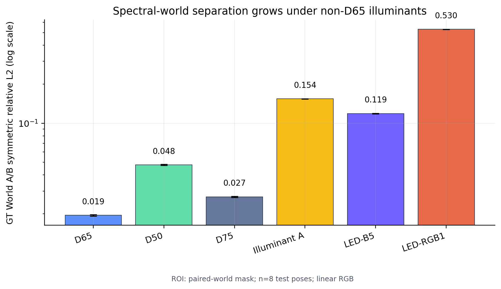
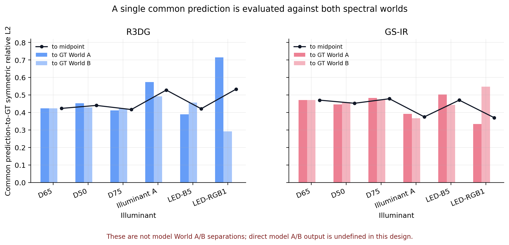
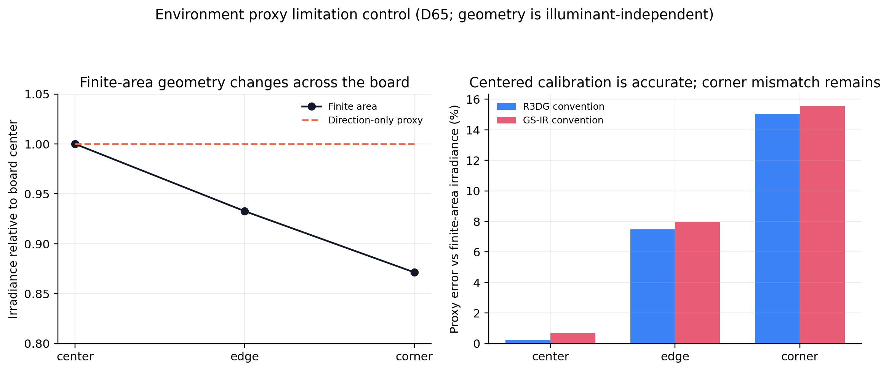

# Causal Metamerism Validation Report

## 요약

이번 검증은 스펙트럼은 서로 다르지만 D65 조명 아래 Nikon 카메라 RGB가 같은 World A와 World B가, 조명이 바뀌었을 때 서로 다른 색으로 나타나는 현상을 기준 정답에서 재현하고, 그 차이를 R3DG와 GS-IR의 relighting 결과와 연결할 수 있는지 확인했다. 원래의 방향성인 스펙트럼 메타머리즘과 조명 변화에 따른 분리 현상은 유지했으며, 두 모델의 6개 조명 조건과 8개 테스트 포즈 렌더링을 모두 완료했다. 다만 현재 학습 설계는 World A와 World B에 대해 별도 모델을 만들지 않고 하나의 공통 D65 RGB 입력으로 하나의 공통 예측을 만들기 때문에, 모델의 `Pred_A - Pred_B`를 정의할 수 없다. 따라서 이번 결과의 최종 판정은 `INCONCLUSIVE`이며, 이는 실행 실패가 아니라 직접적인 인과 주장을 식별할 수 없다는 정직한 설계 결론이다.

## 왜 이 결론이 중요한가

소스 단계의 exact-D65 검증에서 World A와 World B의 Nikon RGB 상대 거리는 0.000000로 사실상 0이었다. 그럼에도 렌더링된 D65 ROI에서 두 세계의 상대 L2 차이는 0.0195였고, LED-RGB1에서는 0.5304까지 증가했다. 즉, 입력 RGB만 본 모델이 숨겨진 스펙트럼을 구별했는지와, 실제 스펙트럼을 알고 계산한 기준 정답이 조명 변화에 따라 분리되는 현상은 서로 다른 질문이다. 이 둘을 혼동하면 공통 예측과 두 개의 세계별 예측을 잘못 비교하게 된다.

## 실험 구성

실험은 D65, D50, D75, Illuminant A, LED-B5, LED-RGB1의 여섯 조명에서 동일한 평가 ROI와 8개 테스트 포즈를 사용했다. 기준 정답은 linear RGB 배열이며 자동 노출 보정이나 색조 변환을 적용하지 않았다. R3DG와 GS-IR에는 각 조명의 SPD로부터 만든 중심 보정(direction-only) 환경 프록시를 입력했다. 따라서 모델 결과는 최종 스펙트럼 GT가 아니라, 동일한 조명 프록시를 사용한 공통 relighting 예측으로 해석해야 한다.

## 정량 결과

아래 표의 GT A/B 열은 두 스펙트럼 세계 자체의 차이이고, 나머지 열은 하나의 공통 예측을 각각 GT World A, GT World B, 두 GT의 픽셀별 중간값과 비교한 값이다. 값이 작을수록 해당 대상에 가깝다. 이 표의 모델 열은 모델이 A와 B를 각각 출력했다는 뜻이 아니다.

| 조명 | GT A/B 분리 | R3DG→A | R3DG→B | R3DG→중간값 | GS-IR→A | GS-IR→B | GS-IR→중간값 |
|---|---:|---:|---:|---:|---:|---:|---:|
| D65 | 0.0195 | 0.4238 | 0.4236 | 0.4236 | 0.4707 | 0.4707 | 0.4707 |
| D50 | 0.0478 | 0.4533 | 0.4290 | 0.4406 | 0.4469 | 0.4594 | 0.4528 |
| D75 | 0.0270 | 0.4121 | 0.4223 | 0.4170 | 0.4828 | 0.4748 | 0.4787 |
| Illuminant A | 0.1542 | 0.5736 | 0.4921 | 0.5283 | 0.3929 | 0.3674 | 0.3751 |
| LED-B5 | 0.1186 | 0.3901 | 0.4562 | 0.4215 | 0.5029 | 0.4433 | 0.4708 |
| LED-RGB1 | 0.5304 | 0.7150 | 0.2923 | 0.5335 | 0.3346 | 0.5481 | 0.3706 |

LED-RGB1에서 기존에 보고된 R3DG의 paired mean prediction-to-GT 값은 0.5036이고 GS-IR은 0.4414이다. 이 값들은 두 모델 출력 사이의 분리가 아니라, 하나의 공통 예측과 두 개의 GT 사이의 평균 오차다. 따라서 이 값을 `model A/B separation`으로 사용하지 않았다.

## 환경 프록시 한계

환경 프록시는 보드 중심에서의 irradiance를 맞추는 데에는 유효했다. D65 기준 중심 상대 오차는 R3DG 0.24%, GS-IR 0.70%였다. 그러나 유한 면적 광원을 보드 전체에 적용하면 중심 대비 irradiance가 변하며, 코너에서 direction-only 프록시의 상대 오차는 R3DG 15.04%, GS-IR 15.56%였다. 그러므로 이 결과는 방법 성능 점수가 아니라 조명 어댑터의 기하학적 한계를 기록한 것이다.

## 직접 확인된 것과 확인되지 않은 것

이번 실행으로 확인된 것은 첫째, World A와 World B가 소스 D65 RGB에서는 동일하지만 스펙트럼은 다르다는 점, 둘째, 조명 스펙트럼이 바뀌면 기준 정답의 World A/B 분리가 커지는 패턴, 셋째, 두 구현체가 모든 조명과 포즈에 대해 재현 가능한 공통 예측을 생성한다는 점이다. 반대로 현재 산출물만으로는 R3DG나 GS-IR이 숨겨진 World A/B 스펙트럼을 독립적으로 복원했다거나, 모델의 A/B 출력 차이가 GT의 원인적 분리 방향을 따른다고 주장할 수 없다. 해당 값은 출력 구조상 정의되지 않으므로 모든 직접 분리·방향 상관 열을 `NA`로 남겼다.

## 최종 판단과 다음 단계

기존 연구 방향의 노벨티는 유지된다. 즉, RGB 관측의 모호성, 스펙트럼 메타머, 조명 변화에 따른 분리라는 문제 설정 자체는 기준 정답과 다중 조명 검증으로 보존되었다. 이번 범위에서 추가로 필요한 것은 모델을 다시 억지로 두 개 학습하는 것이 아니라, 실제로 세계별 예측을 정의할 수 있는 평가 인터페이스다. 가장 강한 후속 실험은 동일한 장면·카메라·조명에서 World A와 World B의 물리적 재질 또는 스펙트럼 표현을 별도로 조건으로 주고 `Pred_A`, `Pred_B`를 생성한 뒤, 그 차이를 GT delta와 직접 비교하는 것이다. 그 인터페이스가 마련되기 전까지는 이번 결과를 스펙트럼 복원 증명으로 확대 해석하지 않는 것이 맞다.

## 재현성 기록

모델 렌더링은 R3DG 6조건×8포즈와 GS-IR 6조건×8포즈로 총 96개의 linear RGB 예측 배열을 생성했다. 평가 표와 원자료 메타데이터는 이 폴더의 CSV·JSON 파일에 있고, 사람이 바로 확인할 수 있는 그림과 설명은 `visual_record` 폴더에 정리했다. 모든 그림은 수치 산출물에서 직접 생성했으며, 대표 이미지의 sRGB 변환은 시각화 전용이다.
